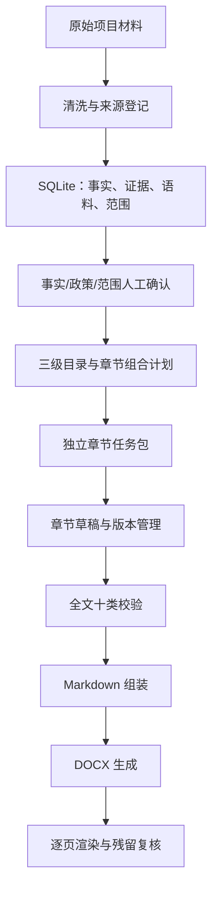

# build-medical-it-feasibility-report 使用说明

## 1. 这个 Skill 做什么

本 Skill 用于从项目空目录和混合项目材料开始，逐步形成医疗信息化政府投资可行性研究报告。它不是“把参考稿换项目名称”的写作模板，而是一条有事实、范围、政策、语料、章节、版本、校验和 Word 交付门禁的本地优先工作流。

核心原则：

- 项目事实、客户范围、公司能力、投资价格四者分离；
- 未确认内容保留 `【待确认】` 或 `【待补充】`，不由模型补写；
- 章节只能使用组合计划绑定的来源；
- 重复初始化、重复导入和重复运行保持幂等；
- PostgreSQL 和 RAG 都不是核心流程的前置条件。

## 2. 当前完成状态

当前版本为 **V1.0 正式版**：本地 SQLite 主链、来源角色隔离、政策与文档标准匹配、范围基线、贯通矩阵、章节编排、版本管理、十类校验、DOCX 模板继承和十阶段统一入口已经完成并通过自动测试。

脱敏 Word 样稿已完成 4 页逐页视觉复核，并登记与当前 DOCX 和全部页面 PNG 哈希绑定的复核记录。每个真实项目的最终候选稿仍必须单独执行相同复核，只有记录与当前 DOCX 匹配时交付门禁才会放行。详情见 `V1_ACCEPTANCE_REPORT.md`。

### 2.1 从 GitHub 安装到其他电脑的 Codex

推荐直接对 Codex 说：

```text
请使用 skill-installer，从 AK51777/Build_Bsoft_Report 仓库的根目录（path 为 .）
安装 Skill，安装名称使用 build-medical-it-feasibility-report。
```

如果在 Codex 终端中直接调用安装器，等价参数是 `--repo AK51777/Build_Bsoft_Report --path . --name build-medical-it-feasibility-report`。安装器默认写入 `$CODEX_HOME/skills`；目标目录已存在时会停止，更新已有安装请使用下方的 Git 克隆方式。

也可以直接克隆到 Codex 的个人 Skill 目录。Windows PowerShell：

```powershell
git clone https://github.com/AK51777/Build_Bsoft_Report.git `
  "$env:USERPROFILE\.codex\skills\build-medical-it-feasibility-report"
```

macOS/Linux：

```bash
git clone https://github.com/AK51777/Build_Bsoft_Report.git \
  ~/.codex/skills/build-medical-it-feasibility-report
```

安装后新建一个 Codex 任务，再输入：

```text
$build-medical-it-feasibility-report
请从零处理 <项目目录>，先盘点材料并建立事实、政策和范围基线，不要直接补写未知事实。
```

仓库根目录就是 Skill 根目录，`SKILL.md` 不应再多嵌套一层。项目材料和运行产物应存放在 Skill 仓库之外；`.gitignore` 会额外阻止常见数据库、凭据、客户材料和项目输出被误提交。

## 3. 从零开始怎么运行

### 3.1 一条命令建立并推进项目

```powershell
python scripts/run_project_pipeline.py <项目目录> `
  --project-code <项目编号> `
  --official-name <正式项目名称> `
  --owner-name <建设单位> `
  --output <项目目录>/运行记录/pipeline-result.json
```

第一次运行会创建标准工作台。把材料放入 `<项目目录>/原始资料` 后再次运行同一命令，系统会：

1. 初始化或复用项目工作台；
2. 建立来源角色登记表，隔离项目材料、参考材料、厂商材料、政策线索和 Word 模板；
3. 清洗 DOCX、Markdown、TXT 并写入本地语料库，项目材料才进入候选事实池；
4. 提取项目材料中的 XLSX 建设清单并写入范围表；
5. 生成政策、文档标准、候选事实、范围基线、参考复用地图和贯通矩阵；
6. 生成 28 个三级章节组合计划并导出独立章节任务包；
7. 执行阶段门禁、工作稿校验和 Markdown 组装；
8. 在全部章节已采纳且交付校验通过后自动生成 Word 候选稿；
9. 校验当前 DOCX 是否已有逐页渲染复核记录；
10. 输出十阶段状态、阻断项、下一步和复盘沉淀候选。

PDF、扫描件、旧版 DOC/XLS、图片 OCR 不会被静默跳过，而会写入 `pipeline-result.json` 的 `blockers`。应先完成可信转换或 OCR，再重新运行。

### 3.2 章节生成与版本管理

章节任务包位于 `<项目目录>/10-章节任务包`。只有状态为 `ready` 的章节才能写入 AI 草稿：

```powershell
python scripts/save_section_draft.py <knowledge.sqlite> <项目编号> <章节编号> `
  <章节正文.md> <章节任务包.json> `
  --model <模型> --prompt-version <提示版本>
```

采纳、废弃或恢复版本：

```powershell
python scripts/manage_section_draft.py <knowledge.sqlite> <项目编号> <章节编号> <版本号> adopt
python scripts/manage_section_draft.py <knowledge.sqlite> <项目编号> <章节编号> <版本号> discard
python scripts/manage_section_draft.py <knowledge.sqlite> <项目编号> <章节编号> <版本号> restore
```

`restore` 会创建新的恢复版本，不覆盖历史稿。

### 3.3 全文和 Word

```powershell
python scripts/assemble_report_markdown.py <knowledge.sqlite> <项目编号> `
  --mode delivery --output report.md --summary assembly-summary.json

python scripts/validate_full_report.py <knowledge.sqlite> <项目编号> `
  --mode delivery --residual-terms 参考残留词表.txt `
  --output validation-result.json

python scripts/build_report_docx.py report.md report.docx `
  --project-name <正式项目名称> --owner-name <建设单位> `
  --summary docx-build-summary.json
```

正式交付前还必须使用文档工具的 `render_docx.py` 将 DOCX 渲染为逐页 PNG，并人工检查全部页面。检查后登记与当前 DOCX 和全部 PNG 哈希绑定的记录：

```powershell
python scripts/record_word_render_review.py report-candidate.docx rendered-pages `
  --reviewed-by <复核人> --result pass --checked-all-pages `
  --output 运行记录/word-render-review.json
```

再次运行统一入口。只有记录仍与当前文件完全匹配时，状态才会成为 `delivery_ready`。

## 4. Skill 怎样运作



关键点是：Codex 写正文前，先读取章节任务包。任务包明确哪些对象可以直接使用、哪些只能参数化改写、哪些只能复用结构、哪些禁止继承。因此不同项目复用的是蓝图和受审知识，不是上一项目的专有事实。

## 5. 各目录和文件的作用

### 5.1 顶层文件

| 文件 | 作用 |
| --- | --- |
| `SKILL.md` | Codex 执行本 Skill 时的总入口、硬规则、阶段顺序和脚本清单。 |
| `README.md` | 面向使用者的运行说明、架构和文件职责。 |
| `V1_IMPLEMENTATION_PLAN.md` | V1 建设里程碑、约束和停止条件。 |
| `V1_ACCEPTANCE_REPORT.md` | 当前实现、测试证据、已知限制和正式验收状态。 |

### 5.2 `references/`

| 文件 | 作用 |
| --- | --- |
| `workflow.md` | 十阶段进入条件、产物、检查和门禁。 |
| `source-and-fact-rules.md` | 来源等级、事实状态、冲突、敏感信息和禁止编造规则。 |
| `policy-evidence-rules.md` | 政策官方来源、有效性、条款和引用矩阵规则。 |
| `scope-mapping-rules.md` | 清单标准化、稳定范围 ID、建设方式、能力映射和投资边界。 |
| `corpus-reuse-rules.md` | 语料 A/B/C/D 复用等级、适用条件和禁止继承内容。 |
| `chapter-task-rules.md` | 贯通矩阵、三级目录、章节任务包和证据骨架。 |
| `medical-it-feasibility-writing.md` | 医疗信息化可研的事实语气、论证结构和专有口径。 |
| `validation-rules.md` | 事实、范围、投资、指标、逻辑、跨章、政策、语言、污染、占位十类校验。 |
| `document-profile-rules.md` | Word 参考模板画像和格式契约。 |
| `word-delivery-rules.md` | Word 清理、合并、页码、表格、渲染和交付记录。 |
| `artifact-schemas.md` | 工作台产物和字段约定。 |
| `knowledge-base-schema.md` | SQLite 各数据层和表之间的关系。 |

### 5.3 `assets/`

| 目录 | 作用 |
| --- | --- |
| `project-workbench-template/` | 新项目初始化时复制的任务书、台账、清单、矩阵、目录、章节任务包和交付记录模板。 |
| `knowledge-base/migrations/` | SQLite 只追加迁移；创建事实、政策、格式、语料、范围、章节、草稿、校验和审计表。 |
| `knowledge-base/seeds/` | 核心政策、文档标准和 12 类章节蓝图/28 个三级目录节点。 |
| `knowledge-base/postgres/` | 可选 PostgreSQL 清洗文档表结构，不是本地流程前置条件。 |

### 5.4 主要脚本

| 脚本 | 作用 |
| --- | --- |
| `init_project_workbench.py` | 幂等创建项目目录、配置、manifest 和 SQLite。 |
| `run_project_pipeline.py` | 一条命令推进本地资料、范围、计划、门禁、校验和工作稿。 |
| `classify_source_roles.py` | 按显式覆盖、保护性关键词和项目默认值区分项目材料与受限参考来源。 |
| `extract_clean_document_blocks.py` | 清洗并分块 DOCX/Markdown/TXT，保留来源位置和哈希。 |
| `ingest_clean_documents_sqlite.py` | 把清洗文本写入本地 `source_document`、`corpus_document`、`corpus_block`。 |
| `extract_xlsx_scope.py` | 不修改原表地提取 XLSX 表头、行、公式和候选字段。 |
| `ingest_scope_items_sqlite.py` | 标准化清单、生成稳定 `SCOPE-*`、保留原始行证据并保护人工确认。 |
| `ingest_product_capabilities.py` | 写入受审公司产品能力。 |
| `map_scope_capabilities.py` | 只对客户已有范围生成候选能力映射，不反向扩大范围。 |
| `build_candidate_fact_workpack.py` | 输出可追溯文本和候选事实字段，不自动把段落认定为事实。 |
| `build_reference_reuse_workpack.py` | 生成保守的参考复用地图和残留词候选，默认不批准直接复用。 |
| `build_scope_baseline.py` / `confirm_scope_baseline.py` | 形成追加式范围快照并记录幂等人工确认。 |
| `build_traceability_matrix.py` | 持久化问题—需求—建设—投资—指标—效益链，缺项明确登记。 |
| `build_section_composition_plan.py` | 写入章节蓝图，生成项目章节计划和来源权限。 |
| `export_section_task_packages.py` | 导出可脱离历史对话继续执行的 JSON/Markdown 章节任务包。 |
| `save_section_draft.py` | 保存章节草稿版本、输入输出哈希和模型调用日志。 |
| `manage_section_draft.py` | 采纳、废弃、恢复章节版本并写审计记录。 |
| `assemble_report_markdown.py` | 只从已采纳版本组装交付稿；缺章时阻断交付模式。 |
| `validate_project_gates.py` | 检查事实、政策、格式和范围阶段门禁。 |
| `validate_full_report.py` | 执行十类全文校验并写入 `validation_run`、`validation_issue`。 |
| `build_report_docx.py` | 生成 A4 中文候选 DOCX、真实标题层级、目录域、页眉、页码和固定表格几何。 |
| `record_word_render_review.py` | 登记人工逐页复核结果，并绑定 DOCX 与每页 PNG 的 SHA-256。 |
| `lint_docx_format.py` | 按格式画像检查标题、缩进、空格、Tab 和表格格式。 |
| `scan_reference_residue.py` | 扫描外地项目、旧单位、供应商或其他残留词。 |

### 5.5 `tests/`

包含初始化、清洗语料、来源隔离、范围与贯通矩阵、能力映射、章节计划、任务包、草稿版本、全文组装、DOCX 结构、三种 Word 模板和三个项目回归测试。`tests/fixtures/word-smoke.md` 是脱敏 Word 排版冒烟样例。

## 6. “洗好的文档内容”现在存在哪里

本地模式已经实现，路径是：

```text
<项目目录>/数据包/数据库/knowledge.sqlite
```

处理链：

```text
原始 DOCX/MD/TXT
  → extract_clean_document_blocks.py
  → <项目目录>/数据包/清洗文本/*.json
  → ingest_clean_documents_sqlite.py
  → knowledge.sqlite
```

数据库中主要存到：

| 表 | 内容 |
| --- | --- |
| `source_document` | 原文件名、路径、类型、SHA-256、来源角色、权限、个人信息标记和清洗元数据。 |
| `corpus_document` | 文种、地域、项目类型、质量等级、使用权限、审核状态和清洗版本。 |
| `corpus_block` | 分块后的 `clean_text`、原文位置、标题角色、文本哈希、复用等级和审核状态。 |

默认新语料为 `C` 级、`pending`，不能未经审核直接进入正式正文。只有 `project_material` 来源会进入候选事实工作包；参考稿、厂商方案、政策线索和格式模板不会被当作目标项目事实。重复导入会更新机械元数据，但不会覆盖 `approved` 或 `prohibited` 等人工审核状态。原始文件不以 BLOB 方式塞入数据库，仍保留在项目材料目录。

可选 PostgreSQL 入口为 `ingest_clean_documents_postgres.py`。它适合多人共享、服务化检索或集中权限管理；单机从零生成项目时不需要先接 PostgreSQL。

## 7. 是否需要 RAG

当前不需要把 RAG 作为 V1 前置条件。现阶段最重要的是：

1. 事实和范围经过确认；
2. 章节计划绑定正确来源；
3. 受审语料按适用条件过滤；
4. 全文校验能阻止越界和编造。

本地 SQLite 已提供结构化过滤和可选 FTS5，足够支持中小规模项目包。只有在“受审语料规模明显增大、检索召回成为瓶颈、且已有可量化基准集”时再增加向量检索。即使增加 RAG，也只能替换候选召回层，不能绕过事实、范围、审核状态和章节来源门禁。

## 8. 稳定生成还依赖什么

要从零形成质量较好的不同项目可研，至少需要：

- 正式项目名称、建设单位、文种和地域；
- 一份经确认的本期范围清单或明确的范围最高依据；
- 核心验收目标及评价体系；
- 投资、工期、资金来源等缺失项的占位或确认策略；
- 可核验的现状材料和政策官方原文；
- 已确认的 Word 模板或允许使用默认 A4 中文候选样式；
- 对章节任务包逐章生成、复核和采纳；
- 交付前完成全文门禁、残留扫描、格式 lint 和逐页渲染检查。
