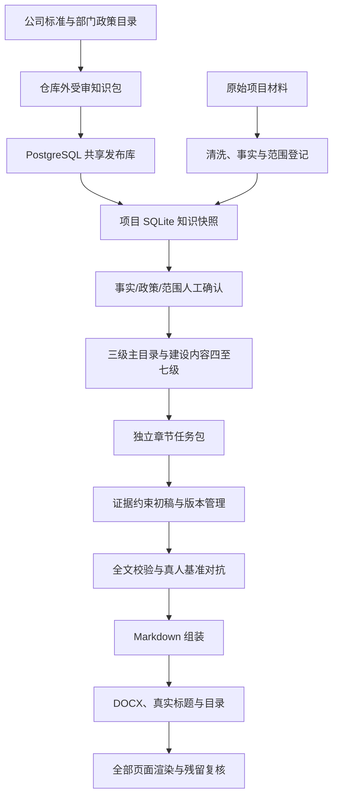

# build-medical-it-feasibility-report 使用说明

## 1. 这个 Skill 做什么

本 Skill 用于从项目空目录和混合项目材料开始，逐步形成医疗信息化政府投资可行性研究报告。它不是“把参考稿换项目名称”的写作模板，而是一条有事实、范围、政策、语料、章节、版本、校验和 Word 交付门禁的本地优先工作流。

核心原则：

- 项目事实、客户范围、公司能力、投资价格四者分离；
- 未确认内容保留 `【待确认】` 或 `【待补充】`，不由模型补写；
- 章节只能使用组合计划绑定的来源；
- 重复初始化、重复导入和重复运行保持幂等；
- 正文不依赖 PostgreSQL 持续在线，但 `server_required` 必须先完成发布知识诊断与项目快照同步；离线运行必须显式选择已验证快照或受审知识包。

## 2. 当前完成状态

当前版本为 **V3 可核验版（本地知识运行时增强）**：在本地 SQLite 主链和公司标准知识包基础上，增加用户级 PostgreSQL profile、只读诊断、确定性知识包/政策目录选择、项目快照完整性门禁、部门政策目录/正式政策证据分层、建设内容四至七级动态层级、建设清单—公司能力—标准语料闭环、证据约束完整工作稿、真人基准评分、重复率门禁、真实 Word 标题和目录更新。

脱敏回归项目 V2.9 工作稿已达到自动基准 100 分：正文可见字符 237,625 个、1,367 个实质段落、727 个标题、25 个表格，Markdown、模板和占位符残留为 0，精确段落重复率 1.17%，模板骨架重复率 1.39%。487 页基准文档已完成全页渲染、自动页面审计和哈希绑定复核，3 页真实目录及跨页表头另行高分辨率检查；未发现空白页、横向异常、表格越界或文字截断。该结果证明生成链和版式链可运行，不代表项目缺失的投资、指标、医院现状或政策确认已经自动补齐。

### 2.1 从 GitHub 安装到其他电脑的 Codex

推荐直接对 Codex 说：

```text
请使用 skill-installer，从 AK51777/Build_Bsoft_Report 仓库的根目录（path 为 .）
安装 Skill，安装名称使用 build-medical-it-feasibility-report。
```

如果在 Codex 终端中直接调用安装器，等价参数是 `--repo AK51777/Build_Bsoft_Report --path . --name build-medical-it-feasibility-report`。安装器默认写入 `$CODEX_HOME/skills`；目标目录已存在时会停止，更新已有安装请使用下方的 Git 克隆方式。

也可以直接克隆到 Codex 的个人 Skill 目录。Windows PowerShell：

```powershell
git clone https://github.com/AK51777/Build_Bsoft_Report.git `
  "$env:USERPROFILE\.codex\skills\build-medical-it-feasibility-report"
```

macOS/Linux：

```bash
git clone https://github.com/AK51777/Build_Bsoft_Report.git \
  ~/.codex/skills/build-medical-it-feasibility-report
```

安装后新建一个 Codex 任务，再输入：

```text
$build-medical-it-feasibility-report
请从零处理 <项目目录>，先盘点材料并建立事实、政策和范围基线，不要直接补写未知事实。
```

#### 启用团队只读知识 MCP

报告 Skill 与只读知识插件位于同一仓库，但需要各安装一次。完成上面的 Skill 安装后，在新设备的 Codex 终端执行：

```bash
codex plugin marketplace add AK51777/Build_Bsoft_Report --ref main
codex plugin add medical-report-knowledge@build-bsoft-report
```

重启 Codex 并新建任务。第一次调用 Skill 时，如果`knowledge_access_status`返回`activation_required`，按提示输入管理员发放的一次性激活码；Skill 会调用`activate_knowledge_access`，并把长期令牌保存在当前系统用户的私有凭据文件中。以后关闭、重新打开 Codex 或新建任务都不需要重复激活。更换电脑或系统用户、删除凭据文件、令牌到期或被管理员吊销后，才需要新码。

插件已经预置生产服务地址`https://ppt.akmaster.cloud/mcp`。激活码和令牌不得写入项目目录、报告、Git 或共享配置。

仓库根目录就是 Skill 根目录，`SKILL.md` 不应再多嵌套一层。项目材料和运行产物应存放在 Skill 仓库之外；`.gitignore` 会额外阻止常见数据库、凭据、客户材料和项目输出被误提交。

### 2.2 在其他 AI 工具中调用

如果该工具兼容 Codex/Agent Skills，把仓库克隆到它要求的 Skill 目录并确保根目录能直接看到 `SKILL.md`，然后用 Skill 名称调用即可。

如果它不支持 Skill 协议，也可以把仓库作为一个只读工作区，给 AI 明确指令：

```text
先读取 <Skill目录>/SKILL.md，并按当前阶段只读取其中指向的 references 文件。
项目工作台必须位于 Skill 仓库外；优先运行 scripts 中已有脚本，不重写同类临时代码。
生成正文前必须建立事实、政策、范围和章节任务包；未知事实不得补写。
```

仅让 AI “拉取 Git 仓库”不会保证自动启用：是否能像 Codex 一样自动触发，取决于该工具是否识别 `SKILL.md`。不识别时需要在每个新任务中显式要求它先读取该文件。

## 3. 从零开始怎么运行

### 3.1 一条命令建立并推进项目

首次使用时，将 `assets/knowledge-base/medical-report-kb.example.json` 复制到 `%USERPROFILE%/.codex/config/medical-report-kb.json`，配置只读账户并在启动工具的进程环境中设置 profile 指定的密码环境变量。不要在 JSON、项目配置或 Git 中保存密码。先执行 `python scripts/knowledge_doctor.py --profile default --json`。

只读账户必须仅能读取已发布运行时视图和 migration 台账，不能直读草稿/审核表，也不能拥有写权限。管理员建账、收权和验证步骤见 `references/knowledge-connection-rules.md` 的“运行时只读账户”。

仓库提供 `scripts/provision_postgres_runtime_reader.py`：默认只输出连接无关的 dry-run 计划；必须同时指定 `--apply` 和精确匹配的 `--confirm-database` 才会修改角色。它拒绝改造管理员/owner、带继承关系或拥有数据库对象的角色，并在提交前验证发布视图 SELECT 和全部基础表无写权限。

```powershell
python scripts/run_project_pipeline.py <项目目录> `
  --project-code <项目编号> `
  --official-name <正式项目名称> `
  --owner-name <建设单位> `
  --knowledge-profile default `
  --word-template <已确认格式模板.docx> `
  --output <项目目录>/运行记录/pipeline-result.json
```

使用 `--output` 时，完整结果写入指定文件，控制台仅打印稳定摘要，避免数百个 block ID 淹没终端；确需调试完整 stdout 时再增加 `--print-full-result`。

无服务器的本地受审包运行必须显式增加 `--knowledge-mode offline_pack --standard-knowledge-pack <本地受审知识包.json>`；只使用已有项目快照时选择 `snapshot_required`。`server_required` 失败不会自动降级。

第一次运行会创建标准工作台。把材料放入 `<项目目录>/原始资料` 后再次运行同一命令，系统会：

1. 初始化或复用项目工作台，解析用户级知识 profile，完成诊断、同步与快照校验；
2. 建立来源角色登记表，隔离项目材料、参考材料、厂商材料、政策线索和 Word 模板；
3. 清洗 DOCX、Markdown、TXT 并写入本地语料库，项目材料才进入候选事实池；
4. 提取项目材料中的 XLSX 建设清单并写入范围表；
5. 生成政策、文档标准、候选事实、范围基线、参考复用地图和贯通矩阵；
6. 依据客户建设清单映射公司能力和标准 block IDs，动态展开四至七级建设目录并导出适用章节任务包；
7. 生成证据约束完整工作稿，执行章节篇幅/事实/范围门禁、工作稿校验和 Markdown 组装；
8. 在章节逐项校验并采纳、交付校验通过且已提供确认模板后生成 Word 候选稿；
9. 校验当前 DOCX 是否已有逐页渲染复核记录；
10. 输出十阶段状态、阻断项、下一步和复盘沉淀候选。

PDF、扫描件、旧版 DOC/XLS、图片 OCR 不会被静默跳过，而会写入 `pipeline-result.json` 的 `blockers`。应先完成可信转换或 OCR，再重新运行。

### 3.2 章节生成与版本管理

章节任务包位于 `<项目目录>/10-章节任务包`。只有状态为 `ready` 且适用的章节才能写入 AI 草稿：

```powershell
python scripts/save_section_draft.py <knowledge.sqlite> <项目编号> <章节编号> `
  <章节正文.md> <章节任务包.json> `
  --model <模型> --prompt-version <提示版本>
```

保存后必须先运行章节校验；未经校验、篇幅不足、缺范围承载、含未绑定高风险数字或命中参考残留的版本不能采纳：

```powershell
python scripts/validate_section_draft.py <knowledge.sqlite> <项目编号> <章节编号> <版本号>
```

采纳、废弃或恢复版本：

```powershell
python scripts/manage_section_draft.py <knowledge.sqlite> <项目编号> <章节编号> <版本号> adopt
python scripts/manage_section_draft.py <knowledge.sqlite> <项目编号> <章节编号> <版本号> discard
python scripts/manage_section_draft.py <knowledge.sqlite> <项目编号> <章节编号> <版本号> restore
```

`restore` 会创建新的恢复版本，不覆盖历史稿。

### 3.3 公司标准方案与清单

公司标准 DOCX/XLSX 不放入公开仓库。先在本地生成受审知识包：

```powershell
python scripts/build_standard_knowledge_pack.py <公司标准方案.docx> <公司标准清单.xlsx> `
  --output <仓库外目录>/智慧医院标准知识包.json
```

历史方案中的政策段默认禁止作为现行政策证据。流水线只为已存在的客户范围生成能力映射候选；未确认候选可按实际选中的 block ID 生成带 `【待确认】` 的 `working_only/structure_only` 评审工作稿，但不能据此扩大范围、形成确定配置或进入正式交付。人工运行 `apply_scope_capability_decisions.py` 确认后，对应语料才可按 `parameterized` 使用。公司能力永远不能创建新的客户范围项。

### 3.4 共享 PostgreSQL 与项目快照

推荐采用“服务器发布、项目快照、本地生成”而不是让每次写作实时查询服务器：

```text
公司标准文件/部门政策目录
  → 仓库外受审 JSON
  → PostgreSQL medical_report_kb 发布库
  → 项目 knowledge.sqlite 快照
  → 章节任务包和正文
```

数据库通过 SSH 隧道连接时，脚本的 `--host` 仍填 `127.0.0.1`，`--port` 填本机隧道端口。密码只放环境变量，不写入命令历史、项目配置或 Git：

```powershell
$env:MEDICAL_FEASIBILITY_DB_PASSWORD = "<数据库密码>"

python scripts/init_postgres_knowledge_db.py `
  --host 127.0.0.1 --port <本机隧道端口> `
  --database <数据库> --user <用户> --output postgres-init.json

python scripts/import_standard_knowledge_pack_postgres.py <受审知识包.json> `
  --publish --host 127.0.0.1 --port <本机隧道端口> `
  --database <数据库> --user <用户> --output standard-pack-import.json

python scripts/import_policy_catalog_postgres.py <部门政策目录.json> `
  --publish --host 127.0.0.1 --port <本机隧道端口> `
  --database <数据库> --user <用户> --output policy-catalog-import.json

python scripts/import_verified_policies_postgres.py <已核验政策条款.json> `
  --publish --host 127.0.0.1 --port <本机隧道端口> `
  --database <数据库> --user <用户> --output verified-policy-import.json

python scripts/sync_postgres_knowledge_snapshot.py <项目knowledge.sqlite> <项目编号> `
  --package-id <知识包ID> --catalog-id <政策目录ID> --policy-topic <主题> `
  --host 127.0.0.1 --port <本机隧道端口> `
  --database <数据库> --user <用户> --output snapshot-sync.json
```

`policy_catalog` 是部门整理的候选目录；`policy_document` / `policy_clause` 才是完成官方核验后可进入正文的正式证据。两者不能批量等同转换。只有显式 `--publish` 且满足审核状态的记录会出现在 `runtime_*` 视图，项目同步脚本只读取这些视图。

没有服务器时，也可以先把目录直接导入单个项目库并生成有限候选清单：

```powershell
python scripts/build_policy_catalog.py <部门政策索引.xlsx> `
  --output <受审政策目录.json>

python scripts/import_policy_catalog_sqlite.py <knowledge.sqlite> `
  <受审政策目录.json> --output policy-catalog-import.json

python scripts/match_policy_catalog_candidates.py <knowledge.sqlite> <项目编号> `
  --topic <项目主题> --limit-per-group 10 `
  --output-json policy-catalog-candidates.json `
  --output-md policy-catalog-candidates.md
```

目录中的重复索引号不会导致丢行：系统按原始行保留全部记录，并写入 `index_occurrence`、`index_conflict` 供复核；真正不允许的是同一来源行重复或稳定记录 ID 冲突。目录候选始终是 `structure_only`，不能直接生成政策要求。

同步后生成过程只读项目 SQLite 快照。标准语料、能力、政策目录候选和正式政策条款分别保留来源类型；目录候选仍是 `candidate_only`，不会因进入快照而升级为正式证据。服务器临时不可用不会中断已建立项目，也不会因共享库更新导致旧项目内容漂移；需要采用新知识时再次同步，会新增快照并保留旧哈希。

### 3.5 证据约束初稿、全文和 Word

可先按适用章节一次生成、校验并采纳工作初稿：

```powershell
python scripts/build_policy_section_material.py <knowledge.sqlite> <项目编号> `
  --mode working --output-json policy-section-material.json `
  --output-md policy-section-material.md

python scripts/build_evidence_bound_initial_drafts.py `
  <knowledge.sqlite> <项目编号> <10-章节任务包> <11-正文工作稿> `
  --output evidence-bound-drafts.json
```

该脚本只能使用任务包绑定的事实、政策、范围、能力和语料。它用于形成可审初稿，不会替代范围确认、投资测算、指标设定或政策核验。

```powershell
python scripts/assemble_report_markdown.py <knowledge.sqlite> <项目编号> `
  --mode delivery --output report.md --summary assembly-summary.json

python scripts/validate_full_report.py <knowledge.sqlite> <项目编号> `
  --mode delivery --residual-terms 参考残留词表.txt `
  --output validation-result.json

python scripts/build_report_docx.py report.md report.docx `
  --project-name <正式项目名称> --owner-name <建设单位> `
  --mode delivery --database <knowledge.sqlite> --project-code <项目编号> `
  --template <已确认格式模板.docx> `
  --summary docx-build-summary.json

python scripts/audit_delivery_artifact.py report.docx `
  --build-summary docx-build-summary.json --database <knowledge.sqlite> `
  --project-code <项目编号> --output delivery-artifact-audit.json
```

正式交付前还必须使用文档工具的 `render_docx.py` 将 DOCX 渲染为逐页 PNG，并人工检查全部页面。检查后登记与当前 DOCX 和全部 PNG 哈希绑定的记录：

```powershell
python scripts/record_word_render_review.py report-candidate.docx rendered-pages `
  --reviewed-by <复核人> --result pass --checked-all-pages `
  --output 运行记录/word-render-review.json
```

再次运行统一入口。只有记录仍与当前文件完全匹配时，状态才会成为 `delivery_ready`。

真人基准对抗检查：

```powershell
python scripts/benchmark_report_quality.py report.docx `
  --reference <真人可研.docx> --database <knowledge.sqlite> `
  --project-code <项目编号> --output benchmark-report.json
```

Word 交付稿必须把 `#` 至 `#######` 转成真实 Heading 样式，更新目录域后再渲染；看到原样 `####`、目录占位文字或缺失字体都应视为未通过。

## 4. Skill 怎样运作



关键点是：Codex 写正文前，先读取项目 SQLite 中的当前快照和章节任务包。任务包明确哪些对象可以直接使用、哪些只能参数化改写、哪些只能复用结构、哪些禁止继承。因此不同项目复用的是蓝图和受审知识，不是上一项目的专有事实；生成过程也不会因服务器知识更新而失去可复现性。

## 5. 各目录和文件的作用

### 5.1 顶层文件

| 文件 | 作用 |
| --- | --- |
| `SKILL.md` | Codex 执行本 Skill 时的总入口、硬规则、阶段顺序和脚本清单。 |
| `README.md` | 面向使用者的运行说明、架构和文件职责。 |
| `QUICKSTART.md` | 最短本地/共享库启动路径和交付检查顺序。 |
| `OPERATIONS_AND_RECOVERY.md` | 中断恢复、幂等重跑、备份和异常处理。 |
| `V1_IMPLEMENTATION_PLAN.md` | V1 建设里程碑、约束和停止条件。 |
| `V2_ACCEPTANCE_REPORT.md` | 当前实现、对抗测试、真人基准和视觉验收证据。 |

### 5.2 `references/`

| 文件 | 作用 |
| --- | --- |
| `workflow.md` | 十阶段进入条件、产物、检查和门禁。 |
| `source-and-fact-rules.md` | 来源等级、事实状态、冲突、敏感信息和禁止编造规则。 |
| `policy-evidence-rules.md` | 政策官方来源、有效性、条款和引用矩阵规则。 |
| `scope-mapping-rules.md` | 清单标准化、稳定范围 ID、建设方式、能力映射和投资边界。 |
| `corpus-reuse-rules.md` | 语料 A/B/C/D 复用等级、适用条件和禁止继承内容。 |
| `chapter-task-rules.md` | 贯通矩阵、三级目录、章节任务包和证据骨架。 |
| `medical-it-feasibility-writing.md` | 医疗信息化可研的事实语气、论证结构和专有口径。 |
| `validation-rules.md` | 事实、范围、投资、指标、逻辑、跨章、政策、语言、污染、占位十类校验。 |
| `document-profile-rules.md` | Word 参考模板画像和格式契约。 |
| `word-delivery-rules.md` | Word 清理、合并、页码、表格、渲染和交付记录。 |
| `artifact-schemas.md` | 工作台产物和字段约定。 |
| `knowledge-base-schema.md` | 私有知识包、共享 PostgreSQL、项目 SQLite 快照及各对象关系。 |

### 5.3 `assets/`

| 目录 | 作用 |
| --- | --- |
| `project-workbench-template/` | 新项目初始化时复制的任务书、台账、清单、矩阵、目录、章节任务包和交付记录模板。 |
| `knowledge-base/migrations/` | SQLite 只追加迁移；创建事实、政策、格式、语料、范围、章节、草稿、校验和审计表。 |
| `knowledge-base/seeds/` | 核心政策、文档标准和 12 类章节蓝图/28 个三级目录节点。 |
| `knowledge-base/postgres/` | PostgreSQL 共享知识、政策目录、正式政策证据、发布视图和迁移。 |

### 5.4 主要脚本

| 脚本 | 作用 |
| --- | --- |
| `init_project_workbench.py` | 幂等创建项目目录、配置、manifest 和 SQLite。 |
| `run_project_pipeline.py` | 一条命令推进本地资料、范围、计划、门禁、校验和工作稿。 |
| `classify_source_roles.py` | 按显式覆盖、保护性关键词和项目默认值区分项目材料与受限参考来源。 |
| `extract_clean_document_blocks.py` | 清洗并分块 DOCX/Markdown/TXT，保留来源位置和哈希。 |
| `ingest_clean_documents_sqlite.py` | 把清洗文本写入本地 `source_document`、`corpus_document`、`corpus_block`。 |
| `extract_xlsx_scope.py` | 不修改原表地提取 XLSX 表头、行、公式和候选字段。 |
| `ingest_scope_items_sqlite.py` | 标准化清单、生成稳定 `SCOPE-*`、保留原始行证据并保护人工确认。 |
| `ingest_product_capabilities.py` | 写入受审公司产品能力。 |
| `map_scope_capabilities.py` | 只对客户已有范围生成候选能力映射，不反向扩大范围。 |
| `build_standard_knowledge_pack.py` / `import_standard_knowledge_pack.py` | 在仓库外构建并导入公司标准方案/清单知识包。 |
| `build_policy_catalog.py` / `import_policy_catalog_sqlite.py` | 从部门索引构建受审目录，并在无服务器时导入项目 SQLite。 |
| `match_policy_catalog_candidates.py` | 按主题分组选择有数量上限的目录候选，仅供核验和结构规划。 |
| `init_postgres_knowledge_db.py` | 幂等建立和核验共享 PostgreSQL schema、表及运行视图。 |
| `audit_postgres_schema.py` | 只读导出服务器迁移哈希、表、字段、约束和索引，供升级前审计。 |
| `import_standard_knowledge_pack_postgres.py` | 将受审标准语料、能力和能力—语料关系导入并显式发布。 |
| `import_policy_catalog_postgres.py` | 导入部门政策候选目录；目录项不自动成为正式政策证据。 |
| `import_verified_policies_postgres.py` | 导入完成官方核验的政策文件、条款、主题和核验记录。 |
| `query_postgres_knowledge.py` | 对发布视图进行有数量上限的只读查询。 |
| `provision_postgres_runtime_reader.py` | 默认 dry-run；经管理员明确批准后，创建或收紧仅可读取 migration 台账和发布运行视图的专用账号，并验证无基础表写权限。 |
| `sync_postgres_knowledge_snapshot.py` | 把服务器已发布知识同步到项目 SQLite，并保存项目级不可变快照。 |
| `apply_scope_capability_decisions.py` | 追加式记录人工范围—能力映射决定。 |
| `build_candidate_fact_workpack.py` | 输出可追溯文本和候选事实字段，不自动把段落认定为事实。 |
| `build_reference_reuse_workpack.py` | 生成保守的参考复用地图和残留词候选，默认不批准直接复用。 |
| `build_scope_baseline.py` / `confirm_scope_baseline.py` | 形成追加式范围快照并记录幂等人工确认。 |
| `build_traceability_matrix.py` | 持久化问题—需求—建设—投资—指标—效益链，缺项明确登记。 |
| `build_section_composition_plan.py` | 写入章节蓝图，生成项目章节计划和来源权限。 |
| `build_report_outline.py` / `confirm_report_outline.py` | 从当前章节计划和动态建设节点形成一至七级候选目录，记录来源签名并显式确认；来源变化后旧确认自动失效。 |
| `export_section_task_packages.py` | 导出可脱离历史对话继续执行的 JSON/Markdown 章节任务包。 |
| `build_dynamic_construction_outline.py` | 按范围—能力—语料生成建设内容四至七级动态层级。 |
| `build_policy_section_material.py` | 从同一政策匹配运行生成政策依据、标准规范表和可追溯段落素材。 |
| `build_evidence_bound_initial_drafts.py` | 按任务包批量形成、校验并采纳证据约束工作初稿。 |
| `save_section_draft.py` | 保存章节草稿版本、输入输出哈希和模型调用日志。 |
| `validate_section_draft.py` | 检查篇幅、论证段、范围承载、表格、数字证据和参考残留。 |
| `manage_section_draft.py` | 采纳、废弃、恢复章节版本并写审计记录。 |
| `assemble_report_markdown.py` | 按当前确认版目录的标题、层级和顺序组装已采纳版本；目录未确认、已失效或缺章时阻断交付模式。 |
| `validate_project_gates.py` | 检查事实、政策、格式和范围阶段门禁。 |
| `validate_full_report.py` | 执行十类全文校验并写入 `validation_run`、`validation_issue`。 |
| `build_report_docx.py` | 工作模式生成带标识稿；正式模式校验数据库、内容哈希、模板和授权后转换 Markdown 六级语义。 |
| `audit_delivery_artifact.py` | 独立检查 DOCX 深度、语义标题、Markdown 残留、模板和正式授权链。 |
| `benchmark_report_quality.py` | 与真人可研比较完整度、规模、表格、重复率和模板残留。 |
| `record_word_render_review.py` | 登记人工逐页复核结果，并绑定 DOCX 与每页 PNG 的 SHA-256。 |
| `lint_docx_format.py` | 按格式画像检查标题、缩进、空格、Tab 和表格格式。 |
| `scan_reference_residue.py` | 扫描外地项目、旧单位、供应商或其他残留词。 |

### 5.5 `tests/`

包含初始化、清洗语料、来源隔离、共享 PostgreSQL、项目快照、政策目录/正式条款、标准知识包、范围与贯通矩阵、能力映射、动态四至七级章节、证据约束初稿、重复率与真人基准门禁、全文组装、正式授权、DOCX 真实标题和目录、三种 Word 模板及多个项目回归测试。`tests/fixtures/word-smoke.md` 是脱敏 Word 排版冒烟样例。

## 6. 知识包和“洗好的文档内容”存在哪里

### 6.1 项目材料清洗结果

每个项目的运行库路径是：

```text
<项目目录>/数据包/数据库/knowledge.sqlite
```

处理链：

```text
原始 DOCX/MD/TXT
  → extract_clean_document_blocks.py
  → <项目目录>/数据包/清洗文本/*.json
  → ingest_clean_documents_sqlite.py
  → knowledge.sqlite
```

数据库中主要存到：

| 表 | 内容 |
| --- | --- |
| `source_document` | 原文件名、路径、类型、SHA-256、来源角色、权限、个人信息标记和清洗元数据。 |
| `corpus_document` | 文种、地域、项目类型、质量等级、使用权限、审核状态和清洗版本。 |
| `corpus_block` | 分块后的 `clean_text`、原文位置、标题角色、文本哈希、复用等级和审核状态。 |

默认新语料为 `C` 级、`pending`，不能未经审核直接进入正式正文。公司标准知识包作为 `shared` 语料进入本地 SQLite，但只有已审核块可召回；建设内容还必须经过确认的范围—能力映射。只有 `project_material` 来源会进入候选事实工作包；参考稿、厂商方案、政策线索和格式模板不会被当作目标项目事实。重复导入保持幂等。原始文件不以 BLOB 方式塞入数据库，仍保留在项目材料目录。

### 6.2 公司标准知识包

`build_standard_knowledge_pack.py --output` 指定的位置就是私有知识包文件位置。建议统一放在 Skill 和项目目录之外，例如：

```text
<私有知识库根目录>/标准方案/智慧医院标准知识包-v3.json
```

这个 JSON 是可搬运、可审计的发布输入，不应提交到公开 Git。导入项目 SQLite 后，内容仍进入 `corpus_document`、`corpus_block`、`product_capability` 和能力—语料关系表；导入 PostgreSQL 后进入 `medical_report_kb` schema。

### 6.3 共享服务器知识库

共享 PostgreSQL 主要存储：

| 表或视图 | 内容 |
| --- | --- |
| `knowledge_package` | 受审知识包版本、权限、哈希和发布状态。 |
| `corpus_document` / `corpus_block` | 洗好的标准方案文档和原子段落。 |
| `product_capability` / `capability_block` | 标准清单能力及可引用正文块。 |
| `policy_catalog` / `policy_catalog_entry` | 部门政策候选目录。 |
| `policy_document` / `policy_clause` | 官方核验后的正式政策文件和条款。 |
| `runtime_*` | 只暴露已发布、已审核、已核验记录的运行视图。 |

项目同步记录保存在本地 `shared_knowledge_snapshot` / `shared_knowledge_snapshot_item`，因此可以证明某次报告具体使用了服务器上的哪一版知识。

`ingest_clean_documents_postgres.py` 仍保留为通用清洗文档入口；公司标准方案、部门目录和正式政策应优先使用各自专用导入脚本，避免把不同证据等级混为普通文本。

## 7. 是否需要 RAG

当前不需要把向量 RAG 作为前置条件。现阶段最重要的是：

1. 事实和范围经过确认；
2. 章节计划绑定正确来源；
3. 受审语料按适用条件过滤；
4. 全文校验能阻止越界和编造。

本地 SQLite 已提供结构化过滤和可选 FTS5，共享 PostgreSQL 又提供按发布状态、模块、章节角色和主题的限定查询，足够支持当前规模。只有在“受审语料明显增大、关键词召回成为瓶颈、且已有可量化问答/段落基准集”时再增加向量检索。即使增加 RAG，也只能在 PostgreSQL 发布视图或项目快照上生成候选，不能绕过事实、范围、审核状态和章节来源门禁。

## 8. 稳定生成还依赖什么

要从零形成质量较好的不同项目可研，至少需要：

- 正式项目名称、建设单位、文种和地域；
- 一份经确认的本期范围清单或明确的范围最高依据；
- 核心验收目标及评价体系；
- 投资、工期、资金来源等缺失项的占位或确认策略；
- 可核验的现状材料和政策官方原文；
- 已确认的 Word 模板；默认 A4 中文样式只允许生成带标识的工作稿，不能形成正式交付；
- 对章节任务包逐章生成、复核和采纳；
- 交付前完成全文门禁、残留扫描、格式 lint 和逐页渲染检查。
